# Jennica Superlative Leads Workflow Diagram

## Full Workflow Overview

---

## Phase 1 Detail: Jennica's Hunt

```mermaid
flowchart LR
    subgraph DAILY["Jennica's Daily Routine"]
        A1["Check Courted.ai\nfor superlatives"] --> A2["Find agent with\n2-12 deals + achievement"]
        A2 --> A3["Check Monday:\nNot in timeout?"]
        A3 -->|"Clear"| A4["Send congrats SMS\nvia JustCall"]
        A3 -->|"In timeout"| A5["Skip - check tomorrow"]
        A4 --> A6["Update Monday:\nStatus → SMS Sent"]
    end

    subgraph SUPERLATIVES["Superlative Types"]
        S1["🏠 New Listing"]
        S2["🎉 Closed Sale"]
        S3["📝 Pending Deal"]
        S4["📈 YoY Growth"]
        S5["🏆 Award/Recognition"]
    end

    subgraph SMS["SMS Template"]
        T1["Hey [Name] - saw you just\ngot [superlative] on [detail].\nAmazing! Great job!\n- Ana @ Kale"]
    end
```

---

## Phase 2 Detail: Ana's Engagement

```mermaid
flowchart TD
    subgraph ENTRY["Entry Point"]
        E1["Lead replies to SMS"]
        E2["Monday: Status → Replied"]
        E3["Ana gets notified"]
    end

    subgraph ENGAGE["Initial Engagement"]
        G1["Ana responds warmly"]
        G2{"What resonates?"}
        G3["Offer ChatGPT tool"]
        G4["Invite to Thursday training"]
        G5["Both in parallel"]
    end

    subgraph VALUE["Value Delivery"]
        V1["Tool Offered"]
        V2["Tool Engaged\n(they're using it)"]
        V3["Training Invited"]
        V4["Training Attended"]
        V5["💡 GRATITUDE MOMENT\n(they thank Ana)"]
    end

    subgraph DEEPEN["Relationship Building"]
        D1["Identify pain points"]
        D2["Provide more value"]
        D3["Build trust over time"]
        D4["Watch for right moment"]
    end

    subgraph RECRUIT["Recruiting Pivot"]
        R1["Make The Ask:\n'Have you ever considered\na different brokerage?'"]
        R2{"Response?"}
        R3["Schedule DJ meeting"]
        R4["Not ready → Hibernation"]
        R5["Hard no → Lost"]
    end

    subgraph CLOSE["Close"]
        C1["DJ Meeting"]
        C2{"Outcome?"}
        C3["🎉 WON"]
        C4["Lost - various reasons"]
        C5["Needs time → Hibernation"]
    end

    E1 --> E2 --> E3 --> G1
    G1 --> G2
    G2 -->|"Tool interest"| G3
    G2 -->|"Training interest"| G4
    G2 -->|"Both"| G5
    G3 --> V1 --> V2
    G4 --> V3 --> V4
    G5 --> V1
    G5 --> V3
    V2 --> V5
    V4 --> V5
    V5 --> D1 --> D2 --> D3 --> D4
    D4 --> R1 --> R2
    R2 -->|"Interested"| R3
    R2 -->|"Not now"| R4
    R2 -->|"Never"| R5
    R3 --> C1 --> C2
    C2 -->|"Signs!"| C3
    C2 -->|"Declines"| C4
    C2 -->|"Thinking"| C5
```

---

## Status State Machine

---

## Automation Triggers

```mermaid
flowchart LR
    subgraph TRIGGERS["What Triggers Status Changes"]
        T1["JustCall: Outbound SMS"] -->|"Webhook"| S1["Status → SMS Sent"]
        T2["JustCall: Inbound SMS"] -->|"Webhook"| S2["Status → Replied"]
        T3["No reply 7 days"] -->|"Scheduled check"| S3["Status → 30-Day Timeout"]
        T4["Timeout expires"] -->|"Daily at 8am"| S4["Status → New Lead"]
        T5["Manual: Ana updates"] -->|"Monday UI"| S5["Various statuses"]
        T6["Negative keywords"] -->|"Auto-detect"| S6["Status → Dead"]
    end

    subgraph SIDE_EFFECTS["Side Effects"]
        S1 --> E1["Set Last Contact Date"]
        S1 --> E2["Assign Jennica"]
        S2 --> E3["Assign Ana"]
        S2 --> E4["Notify Ana (Slack/Email)"]
        S2 --> E5["Log reply in Notes"]
        S3 --> E6["Set Timeout Until (+30 days)"]
        S3 --> E7["Unassign"]
    end
```

---

## How to Use These Diagrams

### Viewing Options

1. **GitHub/GitLab** — Renders Mermaid natively
2. **Notion** — Paste into code block, select "Mermaid"
3. **VS Code** — Install "Mermaid Preview" extension
4. **Online** — Paste at [mermaid.live](https://mermaid.live)
5. **Monday Docs** — May need to export as image first

### Export to Image

Use mermaid.live:
1. Paste diagram code
2. Click "Export" → PNG or SVG
3. Download and embed anywhere

---

## Quick Reference: Status Colors

| Status | Color | Hex | Phase |
|--------|-------|-----|-------|
| New Lead | Gray | #c4c4c4 | Jennica |
| SMS Sent | Light Blue | #579bfc | Jennica |
| 30-Day Timeout | Orange | #fdab3d | Jennica |
| Replied - Awaiting Ana | Purple | #a25ddc | Ana |
| Ana Engaged | Blue | #0086c0 | Ana |
| Tool Offered | Teal | #00c875 | Ana |
| Training Invited | Lime | #9cd326 | Ana |
| Relationship Building | Gold | #cab641 | Ana |
| Ask Made | Orange | #ff642e | Ana |
| Meeting Scheduled | Red | #e2445c | Ana |
| DJ Meeting Complete | Maroon | #bb3354 | Ana |
| Won | Dark Green | #00642e | Endpoint |
| Lost - * | Dark Gray | #757575 | Endpoint |
| Dead - Negative | Black | #333333 | Endpoint |
| Hibernation 90-Day | Light Gray | #e8e8e8 | Endpoint |
