```mermaid
flowchart LR
    subgraph MORNING["☀️ MORNING"]
        A1[Jennica: Check new leads]
        A2[Ana: Check replies]
        A3[DJ: Check meetings]
    end

    subgraph MIDDAY["🌤️ MIDDAY"]
        B1[Jennica: Send SMS batch]
        B2[Ana: Follow up on tools]
        B3[DJ: Send offers]
    end

    subgraph AFTERNOON["🌅 AFTERNOON"]
        C1[Jennica: Log activity]
        C2[Ana: Make asks]
        C3[DJ: Follow-up calls]
    end

    A1 --> B1 --> C1
    A2 --> B2 --> C2
    A3 --> B3 --> C3
```

```mermaid
flowchart TD
    Q1{Did they reply?}
    Q1 -->|Yes| R1[Replied - Awaiting Ana]
    Q1 -->|No 7+ days| R2[30-Day Timeout]
    Q1 -->|Said STOP| R3[Dead - Negative Reply]

    R1 --> Q2{Engaged after tools?}
    Q2 -->|Yes| R4[Relationship Building]
    Q2 -->|No 14+ days| R2

    R4 --> Q3{Said yes to meeting?}
    Q3 -->|Yes| R5[Meeting Scheduled]
    Q3 -->|Not now| R6[Hibernation 90-Day]
    Q3 -->|Never| R7[Lost - Not Interested]

    R5 --> Q4{Meeting outcome?}
    Q4 -->|Good fit| R8[Offer Extended]
    Q4 -->|No show| R9[No Show]
    Q4 -->|Bad fit| R10[Lost - Not Qualified]

    R8 --> Q5{Did they sign?}
    Q5 -->|Yes!| R11[Won 🎉]
    Q5 -->|Joined competitor| R12[Lost - Competitor]
    Q5 -->|No response| R6

    style R11 fill:#27ae60,color:#fff
    style R3 fill:#e74c3c,color:#fff
    style R7 fill:#e74c3c,color:#fff
    style R10 fill:#e74c3c,color:#fff
    style R12 fill:#e74c3c,color:#fff
```

# 🗺️ Workflow Flowcharts

> Visual maps of lead journeys and automations

---

## Lead Journey Flowchart

Copy this into a Notion **Code Block** and select "Mermaid" as the language:

---

## Daily Workflow by Role

Copy this into a Notion **Code Block** and select "Mermaid" as the language:

---

## Handoff Points

Copy this into a Notion **Code Block** and select "Mermaid" as the language:

```mermaid
flowchart LR
    J[🟣 Jennica] -->|"Lead replies"| A[🔵 Ana]
    A -->|"Meeting scheduled"| D[🟢 DJ]
    D -->|"No show"| A
    D -->|"Needs nurture"| A

    style J fill:#9b59b6,color:#fff
    style A fill:#3498db,color:#fff
    style D fill:#27ae60,color:#fff
```

**Handoff Triggers:**
| From | To | Trigger |
|------|-----|---------|
| Jennica → Ana | Lead replies to SMS |
| Ana → DJ | Meeting scheduled |
| DJ → Ana | No-show (reschedule) |
| DJ → Ana | Needs more nurturing |

---

## Automation Map

Copy this into a Notion **Code Block** and select "Mermaid" as the language:

---

## Status Decision Tree

Copy this into a Notion **Code Block** and select "Mermaid" as the language:

---

## How to Add to Notion

1. Create a new page called **🗺️ Workflow Flowcharts**
2. For each flowchart above:
   - Type `/code` and press Enter
   - Select **Mermaid** as the language
   - Paste the code between the triple backticks
3. The flowchart will render automatically!

---

## Quick Reference: Status Colors

| Color | Owner | Statuses |
|-------|-------|----------|
| 🟣 Purple | Jennica | New Lead, SMS Sent |
| 🔵 Blue | Ana | Replied through Meeting Scheduled |
| 🟢 Green | DJ | DJ Meeting Complete through Won |
| 🟡 Yellow | System | Timeout, Hibernation, No Show |
| 🔴 Red | Terminal | All Lost/Dead statuses |
